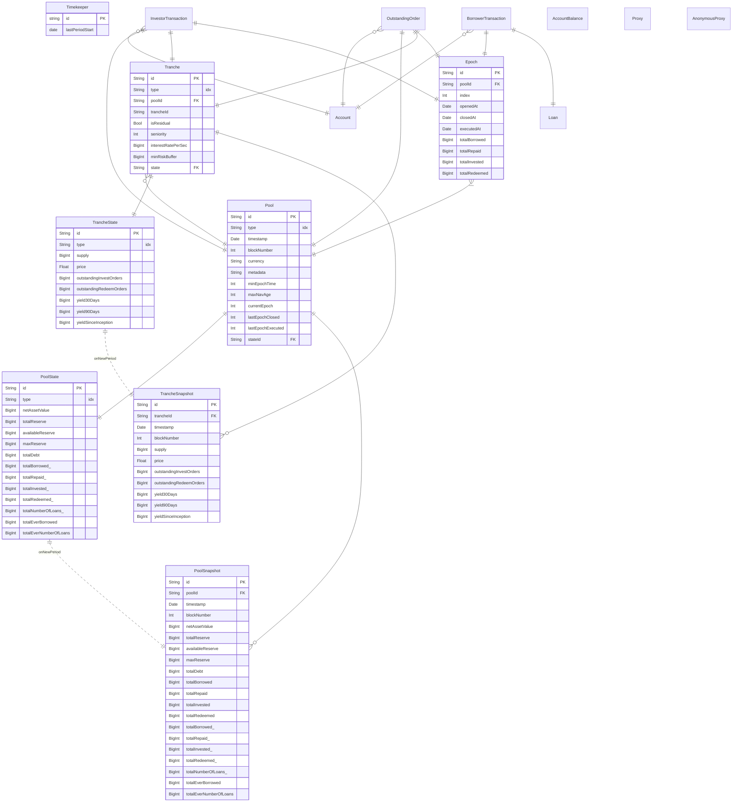

# Centrifuge Subquery

[](https://subquery.network/)

<!-- [](https://www.docker.com/) -->

A GraphQL API to query the Centrifuge Parachain on Polkadot.

## :seedling: Staging

Use GraphQL query endpoint at [https://api.subquery.network/sq/embrio-tech/centrifuge-subql](https://explorer.subquery.network/subquery/embrio-tech/centrifuge-subql) or try the API with the [SubQuery Playground](https://explorer.subquery.network/subquery/embrio-tech/centrifuge-subql).

## :construction_worker_man: Development

### Environment

- [Typescript](https://www.typescriptlang.org/) are required to compile project and define types.
- Both SubQuery CLI and generated Project have dependencies and require [Node](https://nodejs.org/en/).
  - node: version specified in [`.nvmrc`](/.nvmrc)
- [Yarn](https://classic.yarnpkg.com/en/)


### Code generation

To generate the entities based on `schema.graphql`, run:

```
yarn codegen
```

### Run locally

To build and run the subquery locally in Docker, run:

```
yarn build && docker-compose pull && docker-compose up
```

### Access

Open your browser and head to `http://localhost:3000`.

Finally, you should see a GraphQL playground is showing in the explorer and the schemas that are ready to query.

### Linter

#### Automatic Linting

Staged code is linted automatically with a `pre-commit` hook.

#### Manual Linting

You can run the linter with

    yarn lint

To fix fixable lint errors use

    yarn lint:fix

### Commit

This repository uses commitlint to enforce commit message conventions. You have to specify the type of the commit in your commit message. Use one of the [supported types](https://github.com/pvdlg/conventional-changelog-metahub).

    git commit -m "[type]: foo bar"

## Data Model

!!! Data fields ending with an underscore `_` are automatically reset at the end of a period and bust be of type `BigInt`!!!


