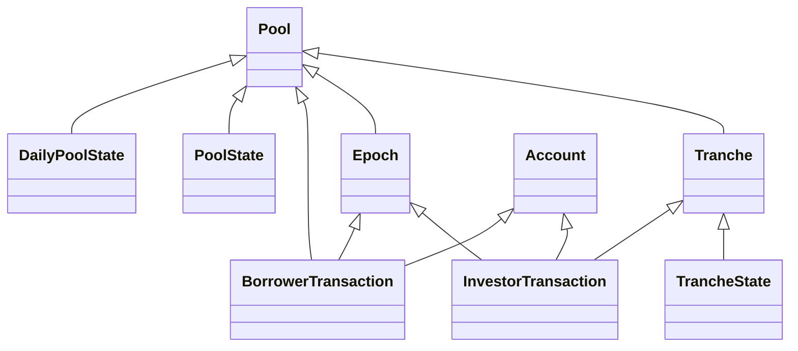

# Centrifuge Pools Subquery

### Environment
- [Typescript](https://www.typescriptlang.org/) are required to compile project and define types.  
- Both SubQuery CLI and generated Project have dependencies and require [Node](https://nodejs.org/en/).

#### Code generation

To generate the entities based on `schema.graphql`, run:

````
yarn codegen
````

#### Run locally
To build and run the subquery locally in Docker, run:

```
yarn build && docker-compose pull && docker-compose up
```

#### Query the project

Open your browser and head to `http://localhost:3000`.

Finally, you should see a GraphQL playground is showing in the explorer and the schemas that are ready to query.

### Entities


